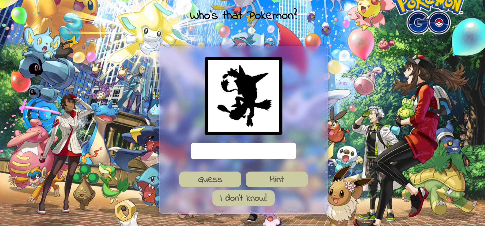

# Guess_That_Pokemon
Guess That Pokemon

 

## **Description 📃**
- A black outline of the pokemon will be displayed on the screen and the player has to guess which pokemon it is.

## **functionalities 🎮**
- There will be options for guess, quit and hint.
 

## **How to play? 🕹️**
- If the player guesses the pokemon without using a hint they are rewarded 100 points.
- If the player guesses the pokemon after taking a hint they are rewarded 50 points.
- If the player incorrectly guesses the pokemon they get 0 points.
- If the player quits they get 0 points.

 

## **Screenshots 📸**

 
